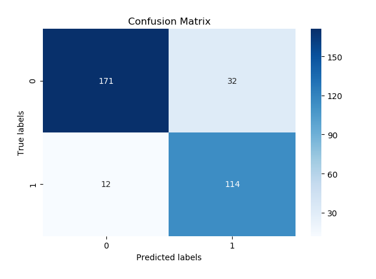
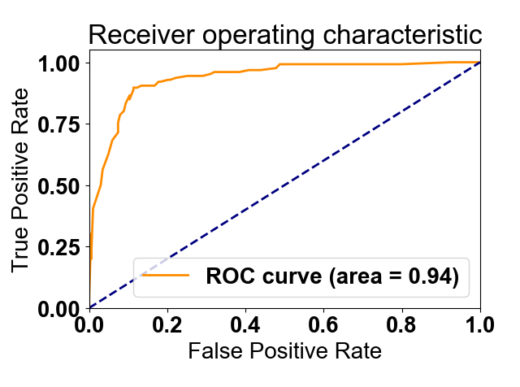
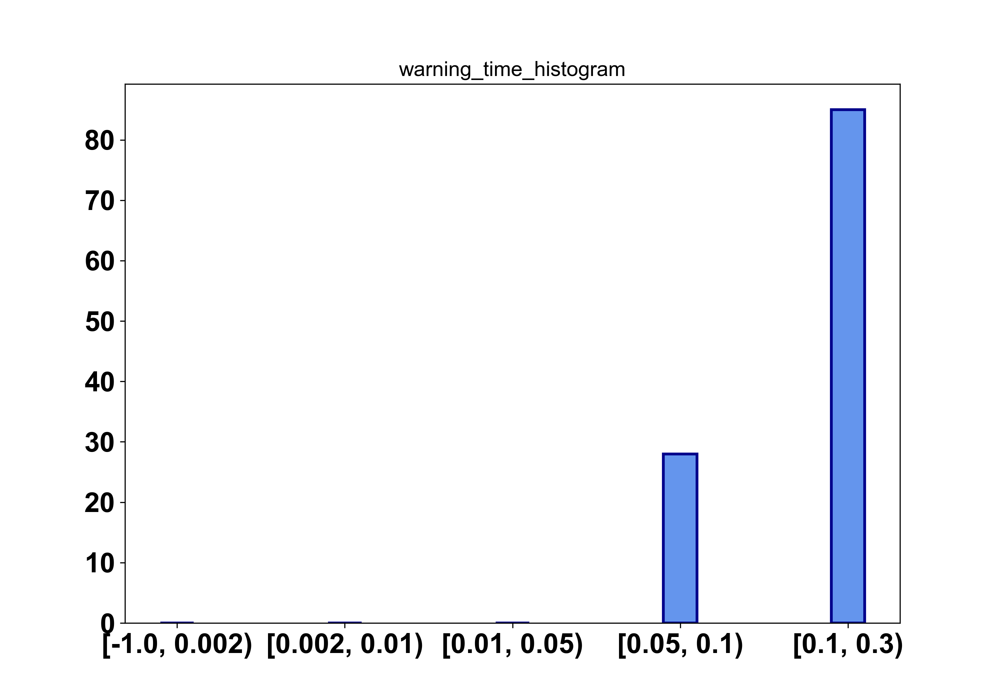
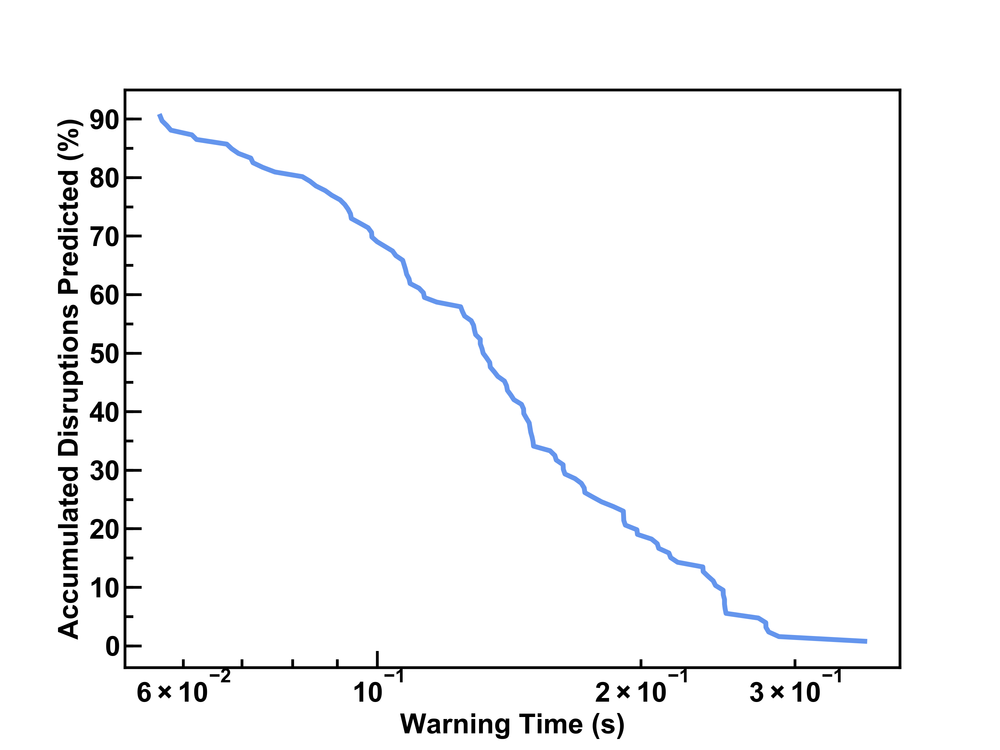

# ITU JTEXT
## Description
This project contains two main files: a freq_main_processing.py file and 
a model_traning_eval.py file. The processing file is used to preprocess raw data
for model training, while the model training and evaluation file converts the
preprocessed data into a matrix format suitable for training a LightGBM model and 
evaluates the performance of the trained model.

## Files
1. `freq_main_processing.py`: This file contains the code for processing the raw 
data. It performs tasks such as data cleaning, feature engineering, and data 
transformation to prepare the data for model training.

2. `model_traning_eval.py`: This file is responsible for training a LightGBM model
using the preprocessed data. It converts the data into a matrix format that can be
consumed by the LightGBM library. Additionally, it evaluates the performance of 
the trained model using suitable metrics.

## Folder 
1. `util`: this folder contains the processors which are used in
'freq_main_processing.py'

## Usage
1. Run the `freq_main_processing.py` script to preprocess the raw data. Make sure
to provide the necessary input data files or modify the code to fetch the data 
from the appropriate source. The processed data will be stored in a format 
suitable for the model training and evaluation step.

2. Once the data has been processed, run the `model_traning_eval.py` script. 
Ensure that the processed data files are accessible by the script. The script 
will train a LightGBM model using the processed data and output the evaluation 
results, such as accuracy, precision, recall, or any other relevant metrics.
## Evaluation
### Confusion Matrix

### ROC Curve

### Histogram Warning Time

### Accumulate Warning Time

## Requirements
- JDDB
